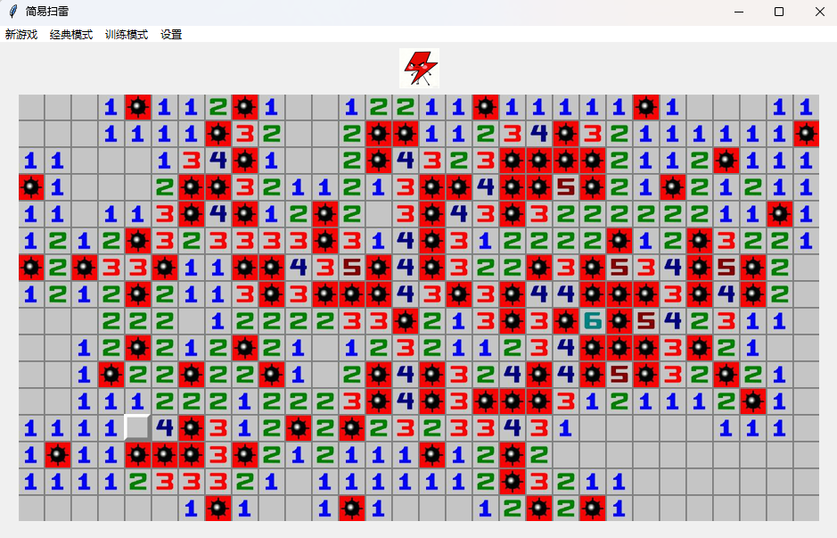

# 闪电扫雷 (lightning-minesweeper) 🎮

[](https://python.org)

一个基于 Python 开发的经典扫雷游戏，具有现代化的图形界面和丰富的游戏功能。

## ✨ 特性

- 🎯 **经典玩法** - 忠实还原 Windows 经典扫雷游戏
- 🎨 **美观界面** - 使用 tkinter 开发的图形化界面
- ⚡ **多难度选择** - 初级、中级、高级三种游戏难度
- 🏆 **多种训练模式** - 找漏雷、直线判雷、定式判雷

## 🚀 快速开始

### 环境要求

- Python 3.8+
- Tkinter

### 运行游戏

```bash
python minesweeper.py
```

## 🎮 游戏操作

- **左键点击** - 揭开格子
- **右键点击** - 标记/取消标记地雷
- **中键点击** - 快速揭开周围格子（当标记数等于周围地雷数时）

## 🗂️ 项目结构

##### 略

## 👥 开发团队

- [lghtnire] 
- [initialencounter]

## 🤝 贡献指南

我们欢迎各种形式的贡献！

## 🎯 游戏截图




---

**享受游戏！如有问题请提交 Issue.** 🎊

```

```
